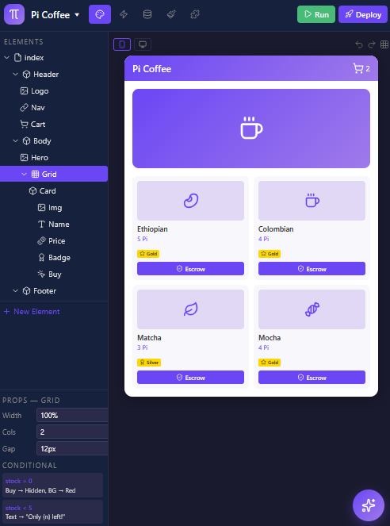

# Pi Visual Builder — PiRC4: The Ultimate AI-Driven No-Code Platform



> **The Power of Visual Development + The Intelligence of Pi AI** — A next-generation visual development platform with a native **AI Agent (Orchestrator)**. Build complex, relational database web apps with step-by-step visual workflows, all powered by natural language prompts.

## 📚 Documentation Index

| # | Document | Description |
|---|----------|-------------|
| 1 | [Component Specification](docs/1-components.md) | 20+ visual components (Layout, Display, Input, Navigation, Pi-Native) |
| 2 | [Logic Blocks](docs/2-logic-blocks.md) | Event blocks, logic blocks, data blocks, Pi SDK blocks |
| 3 | [Code Generation](docs/3-code-generation.md) | React/TS + HTML/CSS output, Pi SDK API, build pipeline |
| 4 | [Component Marketplace](docs/4-marketplace.md) | Publishing, monetization, verification, discovery |
| 5 | [Example Apps](docs/5-examples.md) | 5 complete app examples (e-commerce, services, community, loyalty, HTML) |
| 6 | [Editor UI Layout](docs/6-editor-ui-layout.md) | Professional editor: canvas, property editor, AI assistant panel, workflow canvas, data tab, styles tab |

## 📱 Interactive Mockups (Mobile-Optimized)

| Mockup | Preview |
|--------|---------|
| [🎨 Design Tab](mockups/1-design-tab.html) | Visual canvas with elements tree, property editor, and AI assistant |
| [⚡ Workflow Tab](mockups/2-workflow-tab.html) | Step-by-step logic chains with Pi payment & escrow actions |
| [🗄️ Data Tab](mockups/3-data-tab.html) | Relational database with PiDCTP-linked fields and privacy rules |
| [🎭 Styles Tab](mockups/4-styles-tab.html) | Color/font variables, element styles, live preview with dark theme AI |

## 🤖 The Pi AI Agent (BETA)

The **Pi AI Agent** is the heart of the platform. It's not just a chatbot; it's an **Active Orchestrator** that performs actions across the environment:

1. **Instant UI Implementation**: "Build a form so users can apply to jobs" → AI creates popup, adds input fields, styles them to match your theme.
2. **Logic & Workflow Generation**: "When the user clicks apply, save the data and send a confirmation" → AI builds a 3-step visual workflow: `Show Popup` → `Display Data` → `Send Confirmation`.
3. **Real-time Design Reworking**: "Rework the design to be more professional" → AI adjusts padding, typography, and color schemes across the active screen.
4. **Database Auto-Schema**: AI automatically suggests and creates data types (e.g., `Job Application`) based on the form fields it just built.

## 🏛️ Professional Development Workspace

### 1. Design Tab (Visual Canvas)
- **Pixel-Perfect Canvas**: Drag-and-drop elements with absolute or flexbox positioning.
- **Elements Tree**: Organize components hierarchically (Groups, Text, Buttons, Icons, Shapes).
- **Responsive Engine**: Toggle between Mobile, Tablet, and Desktop views instantly.
- **Property Editor**: Full control over fonts, colors, animations, and conditional states.

### 2. Workflow Tab (Step-by-Step Logic)
- **Visual Logic Chains**: A clear, vertical flow of actions triggered by events.
- **Event Triggers**: `Button is clicked`, `Page is loaded`, `Payment is confirmed`.
- **Action Steps**: Show/Hide elements → Data operations → Ecosystem actions (Send Pi, Award Badge, Open Dispute).

### 3. Data Tab (Relational Manager)
- **Data Types**: Build complex objects like `Merchant`, `EscrowTransaction`, `Job`.
- **Field Mapping**: Link fields directly to PiDCTP on-chain states for verified reputation.
- **Privacy Rules**: Define who can see or modify specific data points.

### 4. API Connector
- **Visual API Builder**: Connect any external REST API without writing code.
- **Native Pi SDK integration**: Visual blocks for all Pi Network core functions.

### 5. Plugins & Marketplace
- **Community Plugins**: Discovery of community-built logic blocks and UI components.
- **Monetization**: Authors earn Pi for their premium plugins.

### 6. Styles Tab
- **Style Variables**: Colors, fonts, spacing — define once, apply everywhere.
- **Element Styles**: Reusable style presets (Button-primary, Card-default, etc.).
- **Pi Design System**: Built-in theme tokens for consistent Pi ecosystem branding.

## 🏗️ Technical Architecture (AI-First)

```
┌─────────────────────────────────────────────────────────────┐
│                   PI VISUAL BUILDER (VB)                    │
├─────────────────────────────────────────────────────────────┤
│ 🤖 PI AI AGENT (Orchestrator: Generates UI, Logic, Data)    │
├──────────┬───────────┬───────────┬───────────┬──────────────┤
│  DESIGN  │ WORKFLOW  │   DATA    │    API    │   PLUGINS    │
│  CANVAS  │  ENGINE   │  MANAGER  │ CONNECTOR │  MARKETPLACE │
└──────────┴─────┬─────┴─────┬─────┴─────┬─────┴──────┬───────┘
                 │           │           │            │
      ┌──────────▼───────────▼───────────▼────────────▼───┐
      │               PI SDK & PiDCTP LAYER               │
      │   (On-Chain Auth, Payments, Escrow, Reputation)   │
      └──────────────────────────┬────────────────────────┘
                                 │
                 ┌───────────────▼───────────────┐
                 │       PI BROWSER RUNTIME      │
                 │   (React/TS Dynamic Web App)  │
                 └───────────────────────────────┘
```

## 🔗 PiRC3 (PiDCTP) Visual Integration

Pi Visual Builder turns complex smart contract calls into simple visual steps:

| Visual Workflow Step | PiRC3 Backend Action |
| :--- | :--- |
| `Verify Seller` | `pi.reputation.getEffectiveScore()` |
| `Create Milestone` | `pi.escrow.createMilestoneEscrow()` |
| `Release Payment` | `pi.escrow.confirmReceipt()` |
| `Lodge Complaint` | `pi.dispute.open()` |
| `Award Verified Badge` | `pi.reputation.awardBadge()` |

## 📅 Roadmap

| Phase | Feature | Status |
|-------|---------|--------|
| **Phase 1** | Visual Foundation (UI Canvas + Basic Workflows) | Proposed |
| **Phase 2** | Data Intelligence (Relational Database + Privacy Rules) | Proposed |
| **Phase 3** | AI Integration (Pi AI Agent for natural language app building) | Proposed |
| **Phase 4** | Global Ecosystem (Plugin Marketplace + Pi App Studio Sync) | Proposed |

## 📄 License

Idea & Proposal License — Original concept by **Ayoub (aybvip)**. Implementation rights belong exclusively to **Pi Network**. No other entity may claim, copy, or implement this idea. See [LICENSE](LICENSE) for full terms.

---

### Links
- **PiRC3 (PiDCTP)**: [PR #378](https://github.com/PiNetwork/PiRC/pull/378)
- **Platform Discussion**: [Issue #381](https://github.com/PiNetwork/PiRC/issues/381)
- **Pi App Studio**: Available in Pi Browser
